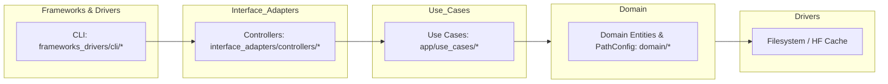
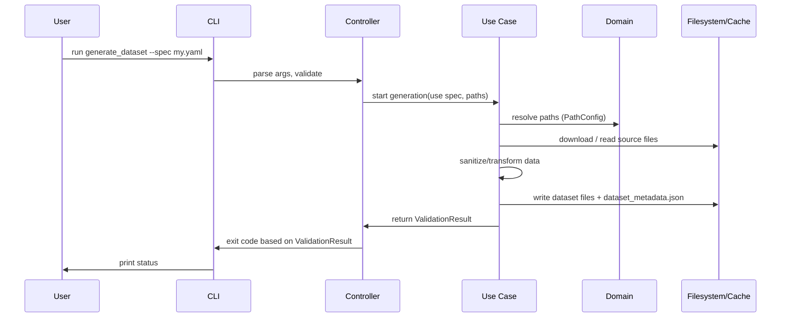
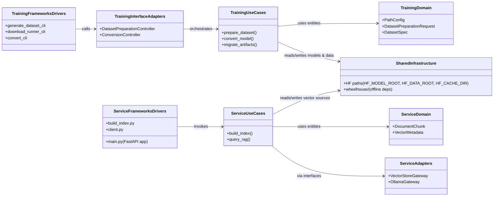

# Architecture and Flow Diagrams

This document contains a high-level architecture diagram and a sequence flow for the dataset generation request described in the repository.

## Clean Architecture Diagram (Mermaid)

## Dataset Generation Sequence (Mermaid Sequence Diagram)

## Notes
- The diagrams are intended for contributors to quickly locate relevant code paths.
- For detailed interaction, open the modules referenced in each layer (mapping in the README).

## High-Level UML Component Diagram (Training & Service)

